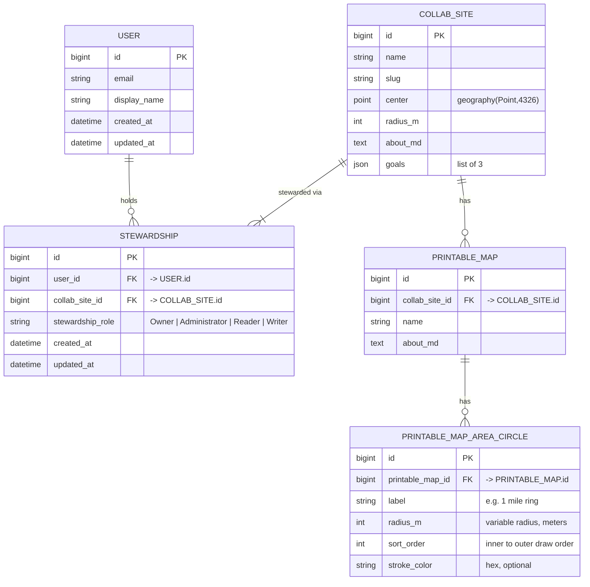

## Why

SPNC-0005 Provides the deployment target to host mspsolarpunk.com and japoofis.com. We need a first small thing
to deploy to this hardware and a strategy to draw users in.

## How

The core components of this work are:
1. An article on Medium/Substack/blogging platform introducing the tool. Ideally I could write the article in markdown and version it in Git and then easily export it to relevant platforms. Start with support for Substack. It is ok if the process is copy and paste with some manual uploads of photos
2. First deployment of a backend API that can collect and serve data in a database for miscellaneous projects such as this one. Many other future projects will use this. This will be a refinement of SPNC-0004. This is the first deployment of the Collabornet API. It will be a REST API implemented in Python FastAPI.
  - [x] This API will first be served at https://collabornet.japoofis.com/api (via proxy from app-ui which has the only https surface area), and later mspsolarpunk.com
  - [x] The implementation will live in projects/collabornet/services/app-api and projects/collabornet/services/app-api-postgres.
      - x app-api should use alembic to manage migrations against an app-api-postgres service. Start with a collab_sites table with just a name string column. Include a seed file that seeds 1 row into the database with a name of "Demo Site". Put this seed data in yaml files inside a fixture folder like `fixtures/demo/collab_sites.yaml`.
      - x the `/` route should just say "OK"
      - x the `/sites` route should show the rows in the `collab_sites` table
      - x Include suite that validates the behavior of endpoints againt the "demo" dataset. Set it up so there could be different tests that run against other fixture sets later.
  - [x] GitHub Actions should automatically build,tag,and push the app-api image from a Dockerfile. The Dockerfile should build for ARM initially, but will also need to build on apple silicon so it can run on my laptop in Docker or Kind later.
3. A frontend app with a very simple user interface that lets users choose a point on a map as the center, then select 3 circles of various radius from that center point. Then it provides a button to render the map that fills a 8x11 page/square. Later, after login, users will be able to pay for fully rendered tiff they can take it to a printshop.
  - x This UI will live at https://collabornet.japoofis.com/radius, and later mspsolarpunk.com
  - The implementation will live in projects/collabornet/services/app-ui
    - It should use React, Leaflet,
    - The first pass cut should simply show a shell React page and a map of the world. The second cut will involve interacting with the Collaborate app-api service
  - [x] GitHub Actions should automatically build,tag,and push the image from a Dockerfile. The Dockerfile should build for ARM initially, but will also need to build on apple silicon so it can run on my laptop in Docker or Kind later.

## Design thinking for /radius page

### Page appearance

Faded picture of a map with circles on it with leafy border. Map area fuzzed out so it doesn't compete with foreground text

### Content

Rebuilding the world begins by declaring stewardship over the immediate area where you live.

Focus on building relationships with the people, businesses, and organizations physically closest to you.

1. Make a map.
1. Print it big.
1. Frame it, hang it, make it look cool.

Everyday, when you see it--it will help you anchor where you are.
Overtime, put pins on it, annotate it, draw on it--turn into something alive, embedded with stories.

[Get Started Button]

### Database structure

This idea draws from projects/collabornet/stories/SPNC-0004.first-usable-local-thing.md

**Stewardship invariants**

- `STEWARDSHIP` is the associative table for the **User ↔ CollabSite** many-to-many; `stewardship_role ∈ {Owner, Administrator, Reader, Writer}`.
- **Every CollabSite always has ≥ 1 `Owner`.** `Administrator` / `Reader` / `Writer` are each 0-to-many. In the ERD, `COLLAB_SITE ||--|{ STEWARDSHIP` enforces "≥ 1 steward"; the stricter "≥ 1 *Owner*" spans multiple rows, so it lives in app logic or a DB trigger (block deleting/demoting the last Owner), not a column `CHECK`.
- One role per (user, site): `UNIQUE(user_id, collab_site_id)`. If a user may hold several roles on one site, switch to `UNIQUE(user_id, collab_site_id, stewardship_role)`.